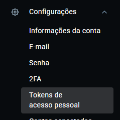

# Projeto FastAPI com CI/CD e GitOps

Este projeto tem como objetivo criar build, deploy e automação de uma aplicação FastAPI rodando em Kubernetes usando CI/CD com GitHub Actions e GitOps com ArgoCD, e também usando a gestão do cluster pelo Rancher Desktop, com dois repositorios interligados.

---

## Pré-requisitos

- Conta no **GitHub** (repositório público ou privado).
- Conta no **Docker Hub** com token ou senha de acesso.
- **Rancher Desktop** instalado e com Kubernetes habilitado.
- **kubectl** configurado e funcionando (teste com `kubectl get nodes`).
- **ArgoCD** instalado no cluster Kubernetes local.
- **Git** instalado.
- **Python 3** e **Docker** instalados.
- **Ubuntu** usado para a execução dos comandos.

---

## Avisos importantes

- **Será necessário criar dois repositórios**: 
 - ***Repositório 1***: Vai conter a aplicação FastAPI, o Dockerfile e o GitHub Action Workflow.
 - ***Repositório 2***: Vai conter os manifestos Kubernetes e ArgoCD.

**Precisa também ter uma Chave SSH diretamente vinculada a conta do GitHub**


### Repositorio 1 - Etapa 1 – Criar a aplicação FastAPI

- Criar uma pasta que contém os arquivos e pastas `main.py`, `Dockerfile`, `requirements.txt`, cirar uma pasta templates e o arquivo `html`.

- Criar um repositório Git para a aplicação em ssh (`fastapi-app`).

- Criar o arquivo `main.py` com o código da aplicação:

```python
from fastapi import FastAPI, Request
from fastapi.templating import Jinja2Templates
from fastapi.responses import HTMLResponse
from pathlib import Path

app = FastAPI()
BASE_DIR = Path(__file__).resolve().parent
templates = Jinja2Templates(directory=str(BASE_DIR / "templates"))

@app.get("/", response_class=HTMLResponse)
async def root(request: Request):
    return templates.TemplateResponse("index.html", {"request": request})
```

- Criar o arquivo Dockerfile para containerizar a aplicação.

```Dockerfile
FROM python:3.10-slim

WORKDIR /app

COPY requirements.txt .
RUN pip install --no-cache-dir -r requirements.txt

COPY . .

CMD ["uvicorn", "main:app", "--host", "0.0.0.0", "--port", "80"]
```

- Criar o arquivo requirements

```bash
fastapi
uvicorn
jinja2
```

- Criar a pasta templates
  - Criar o arquivo HTML da aplicação dentro da pasta templates


- Após fazer todos esse processo enviar os arquivos para o repositorio do github (`fastapi-app`)

```bash
git remote add origin git@github.com:SeuUsuario/seu-repo.git # para se conctar ao repositorio remoto e usando o link em ssh

git init # para iniciar o repositorio 

git add . # para adicionar as alterações

git commit -m "seu commit" # para descrever a alterações

git push # para enviar tudo pro repositorio remoto
```
---
### Repositorio 1 - Etapa 2 - Criação dos secrets no GitHub

- Iremos usar o Actions secrets parar criar variavels secretas para o login do DockerHub e a chave privada do SSH.

- `Docker_Username`: O usuario do dockerhub.

- `Docker_Passaword`: Ideial criar um token.
  - para criar um token, no menu lateral esquerdo vá em `configurações` e depois em `tokens de acesso pessoal`.





- `Decrição do token de acesso`: escolha uma descrição
- `Data de validade`: Nenhuma
- `Permissão de acesso`: Ler, Escrever, apagar
- Clique em Gerar e adicione esse token no segredo da senha do login


- `SSH_Private_Key`: Execute o comando baixo para criar chaves ssh.

```bash
ssh-keygen -t ed25519 -C "seu-email@example.com"
```

- Acesse a chave privada com:

```bash
cat ~/.ssh/id_ed25519
```

- Acesse a chave publica com:

```bash
cat ~/.ssh/id_ed25519
```
- Para fazer o segredo do SSH precisa da chave privada.


**Criação do segredo**
- No primeiro repositorio `projeto-ci-cd-fastapi-app`.
  - Vá em `Settings`.
  - Assim que entrar na configuração procure por `Secrets and variables`.
    - Escolha `Actions`.
    - Clique em `New repository secret`
    - Escolha um nome
    - Em `Secret` será adiconado o valor secreto
---

### Repositorio 1 - Etapa 3 – Configurar o arquivo para o GitHub Actions

- No direito do (fastapi-app), criar uma pasta oculta `.github` dentro dessa pasta criar uma subpasta chamada `workflow` que vai conter o arquivo `ci-cd.yml` nele será adicionado o arquvio de configurção para o gitactions :

- Edite `ci-cd.yml` no editor de texto nano


- Arquivo de configuração pata o GitActions:


```yaml
name: CI/CD FastAPI

on:
  push:
    branches: [ "main" ]

jobs:
  build-and-push:
    runs-on: ubuntu-latest

    steps:
    - name: Checkout código
      uses: actions/checkout@v3

    - name: Configurando o SSH
      uses: webfactory/ssh-agent@v0.8.0
      with:
        ssh-private-key: ${{ secrets.SSH_PRIVATE_KEY }}

    - name: Premissão para o GitHub à lista de hosts confiáveis
      run: |
        mkdir -p ~/.ssh
        ssh-keyscan github.com >> ~/.ssh/known_hosts

    - name: Login Docker Hub
      run: echo "${{ secrets.DOCKER_PASSWORD }}" | docker login -u "${{ secrets.DOCKER_USERNAME }}" --password-stdin

    - name: Definição de TAG
      run: echo "tag=$(date +%s)" >> $GITHUB_ENV

    - name: Build imagem
      run: docker build -t ${{ secrets.DOCKER_USERNAME }}/fastapi-app:${{ env.tag }} .

    - name: Push imagem
      run: docker push ${{ secrets.DOCKER_USERNAME }}/fastapi-app:${{ env.tag }}

    - name: Clonando repo(2) de manifests e atualizando a imagem
      run: |
        git clone git@github.com:usuario/projeto-ci-cd-fastapi-manifests.git
        cd projeto-ci-cd-fastapi-manifests
        sed -i "s|image: .*|image: ${{ secrets.DOCKER_USERNAME }}/fastapi-app:${{ env.tag }}|" k8s/deployment.yaml
        git config user.name "github-actions"
        git config user.email "github-actions@github.com"
        git add k8s/deployment.yaml
        git commit -m "update image tag ${{ env.tag }}"
        git push 
```
- Enviar toda alteração para o GitHub

- **Oque esté arquivo faz? ele serva para**:

- Checkout do código.

- Configuração do SSH com chave privada armazenada em segredo (SSH_PRIVATE_KEY) para acessar o repositório fastapi-manifests.

- Login no Docker Hub usando segredos (DOCKER_USERNAME e DOCKER_PASSWORD).

- Build da imagem Docker e push para o Docker Hub.

- Clona o repositório fastapi-manifests.

- Atualiza o arquivo k8s/deployment.yaml com a nova tag da imagem.

- Commit e push da alteração no repositório de manifests.


### Repositorio 2 - Etapa 1 – Criar os repositório de manifests Kubernetes

- Criar um repositório Git separado em ssh (`fastapi-manifests`).

- Criar uma pasta fastApi-manifests com subpasta e arquivos, `subpastas k8s`, `deployment.yaml`, `service.yaml` usando o `touch` e o nome do arquivo

- Adicionar os arquivos Kubernetes na pasta k8s/:

- deployment.yaml: Criar o deployment da aplicação (imagem Docker, réplicas, etc).

```yaml
apiVersion: apps/v1
kind: Deployment
metadata:
  name: fastapi-app
  labels:
    app: fastapi
spec:
  replicas: 1
  selector:
    matchLabels:
      app: fastapi
  template:
    metadata:
      labels:
        app: fastapi
    spec:
      containers:
        - name: fastapi-container
          image: usuario-dockerhub/fastapi-app:1753187087
          ports:
            - containerPort: 80
```

- Service.yaml: cria o service para expor o deployment no cluster.

```yaml
apiVersion: v1
kind: Service
metadata:
  name: fastapi-service
spec:
  selector:
    app: fastapi
  ports:
    - protocol: TCP
      port: 80
      targetPort: 80
  type: ClusterIP
```

- Após fazer todos esse processo enviar os arquivos para o repositorio do github (`fastapi-manifests`)

```bash
git remote add origin git@github.com:SeuUsuario/seu-repo.git # para se conctar ao repositorio remoto e usando o link em ssh

git init # para iniciar o repositorio 

git add . # para adicionar as alterações

git commit -m "seu commit" # para descrever a alterações

git push # para enviar tudo pro repositorio remoto
```

---

### Configurar o ArgoCD

- Instalar o ArgoCD no cluster Kubernetes.

```bash
kubectl create namespace argocd # criar o namespace

kubectl apply -n argocd -f https://raw.githubusercontent.com/argoproj/argo-cd/stable/manifests/install.yaml # instala o argo

kubectl get pods -n argocd # verficar se os pods estão rodando

```

- Para rodar o ArgoCD via navegador localmente:

```bash
kubectl port-forward svc/argocd-server -n argocd 8080:443
```

- Acesse no navegdor com:
  - https://localhost:8080


- Faça o login

**Username**: admin

- Para saber a senha execute o seguinte comando:

```bash
kubectl get secret argocd-initial-admin-secret -n argocd -o jsonpath="{.data.password}" | base64 -d && echo
```


- Conectar o repositorio do github que contém os arquivos `deployment` e `service`  ao argo
  - Vá em `Settings` e depois em `Repositories`


- Vá em connect repo

  - `Name`: Esolha um nome. 
  -`Project`: Default.
  - `Repository URL`: link via ssh do repositorio.
  - `SSH private key data`: Adicone o ssh privado.
  - Clique em connect


  


- Criação da aplicação no ArgoCD
  - Vá em `applications` e `New Apps`

- Em general:
  - `Appliction Name`: Escolha um nome para aplicação.
  - `Project Name`; Default.


- Em Source:
  - `Repository URL`: git@github.com:usuario/projeto-ci-cd-fastapi-manifests.git.
  - `Revision`: Main.
  - `Path`: k8s.

- Em Desnation:
  - `Cluster URL`: A URL já aparece ao clicar na caixinha.
  - ``Namespace`: Default.


- ArgoCd já sicronizado com o repostorio e rodando a aplicação.


---

### GitAction e DockerHub

- Arquivo de configuração rodando no GitActions


- Nova imagem criada pelo GitActions no segundo repositorio


- Build e push da imagem para o DockerHub


### Teste de aplicação 

- Executando aplicação com `port-forward` na porta 80:


- Verificar se o `pod` está rodando:


- Serviços da aplicação:


- Containers rodando:


- Aplicação rodando no navegador pela a porta 80:


---


